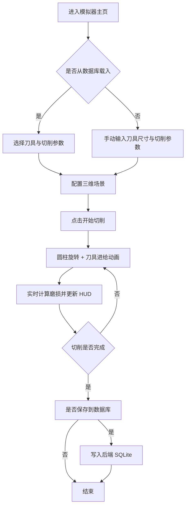

## 1. 产品概述

本项目是一套面向特种金属切削加工的「刀具磨损几何干涉三维全栈模拟器」。通过在网页端以三维形式重建圆柱形零件与长方体车刀的切削过程，帮助工艺工程师直观观察刀具进给路径与磨损演化，从而在试切前预判刀具干涉与磨损风险。

- 目标用户：机械加工工艺工程师、数控编程人员、刀具研发与质量工程师。
- 核心价值：把抽象的切削参数（切削速度、进给量、切深）转化为可视的几何运动与磨损读数，降低试切成本与刀具损耗。

## 2. 核心功能

### 2.1 用户角色

本系统为单机工艺工具，不区分用户角色，所有访客均可使用全部功能。

### 2.2 功能模块

1. **模拟器主页**：三维切削场景、控制面板、实时 HUD 读数。
2. **工艺数据库页**：已保存的刀具与切削参数列表，支持新增与回填到模拟器。

### 2.3 页面详情

| 页面名称 | 模块名称 | 功能描述 |
|-----------|-------------|---------------------|
| 模拟器主页 | 三维视口 | 渲染圆柱零件与长方体刀具，按参数驱动切削动画，支持旋转/缩放/平移 |
| 模拟器主页 | 控制面板 | 输入刀具尺寸（长宽高）、切削速度、进给量、切深；启动/暂停/重置 |
| 模拟器主页 | 实时 HUD | 显示当前进给位置、已切削时长、估算磨损量、磨损百分比与进度条 |
| 模拟器主页 | 磨损指示 | 刀具随切削进程颜色由亮转暗、刀尖出现磨损标记，临界值报警 |
| 工艺数据库页 | 刀具列表 | 展示后端已存刀具记录，支持新增、删除、一键载入模拟器 |
| 工艺数据库页 | 切削参数列表 | 展示每把刀具关联的切削速度/进给/切深记录，支持新增与载入 |

## 3. 核心流程

用户在模拟器主页输入刀具尺寸与切削参数（或从数据库页一键载入），点击「开始切削」后，三维场景中圆柱零件绕自身轴线旋转，车刀沿轴向进给并切入零件表面。系统按切削时长与参数估算刀具磨损，实时更新 HUD 并在刀尖施加磨损可视化。切削完成后可把当前刀具与参数存入数据库。

## 4. 用户界面设计

### 4.1 设计风格

- **风格定位**：工业精密仪表 / CNC 控制台暗色主题，强调金属质感与切削火花意象。
- **主色**：深石墨底色 `#0b0f14` / 面板 `#131922`，主强调色采用熔融琥珀橙 `#ff7a1a`（代表高温金属与火花），次强调色采用技术青 `#36d6e7`（代表数据 HUD）。
- **按钮风格**：方形切角、细描边、悬停发光，主操作按钮带琥珀色辉光。
- **字体**：标题使用 `Chakra Petch`（几何工程仪表感），数据读数使用 `JetBrains Mono`，正文使用 `Sora`。
- **布局风格**：左侧固定控制面板 + 中央大三维视口 + 右侧悬浮 HUD 读数，桌面优先。
- **图标/装饰**：使用 lucide 图标；背景叠加细密栅格与噪点纹理增强机械感。

### 4.2 页面设计概述

| 页面名称 | 模块名称 | UI 元素 |
|-----------|-------------|-------------|
| 模拟器主页 | 三维视口 | 暗色金属环境、栅格地面、定向光+点光、火花粒子、相机轨道控制 |
| 模拟器主页 | 控制面板 | 数值输入框、滑块、开始/暂停/重置按钮、参数分组卡片 |
| 模拟器主页 | 实时 HUD | 半透明面板、等宽数字读数、磨损进度条、状态徽标 |
| 工艺数据库页 | 数据表格 | 行式列表、状态标签、操作按钮、新增弹层 |

### 4.3 响应式

桌面优先设计，在 1280px 以上为最佳体验；小屏将控制面板折叠为顶部抽屉，三维视口始终保留主区域。

### 4.4 3D 场景指引

- **环境/氛围**：深色车间环境，弱环境光 + 金属反射，营造精密加工氛围。
- **灯光设置**：主方向光（冷白）模拟车间顶光，刀尖接触点叠加琥珀色点光与火花粒子。
- **相机设置**：透视相机斜俯视，初始视距可纵观零件全长；轨道控制器允许旋转/缩放/平移。
- **构图与焦点**：圆柱零件水平横置为视觉中心，刀具从右侧切入，火花为高光焦点。
- **交互与动画**：圆柱绕轴自转、刀具轴向进给、磨损阶段刀尖变色与缩进、火花粒子持续喷射。
- **后处理**：轻微辉光（Bloom）增强火花与金属高光。
- **资源与性能**：程序化几何（圆柱+长方体）无外部模型，粒子数量受控，保证 60fps。
