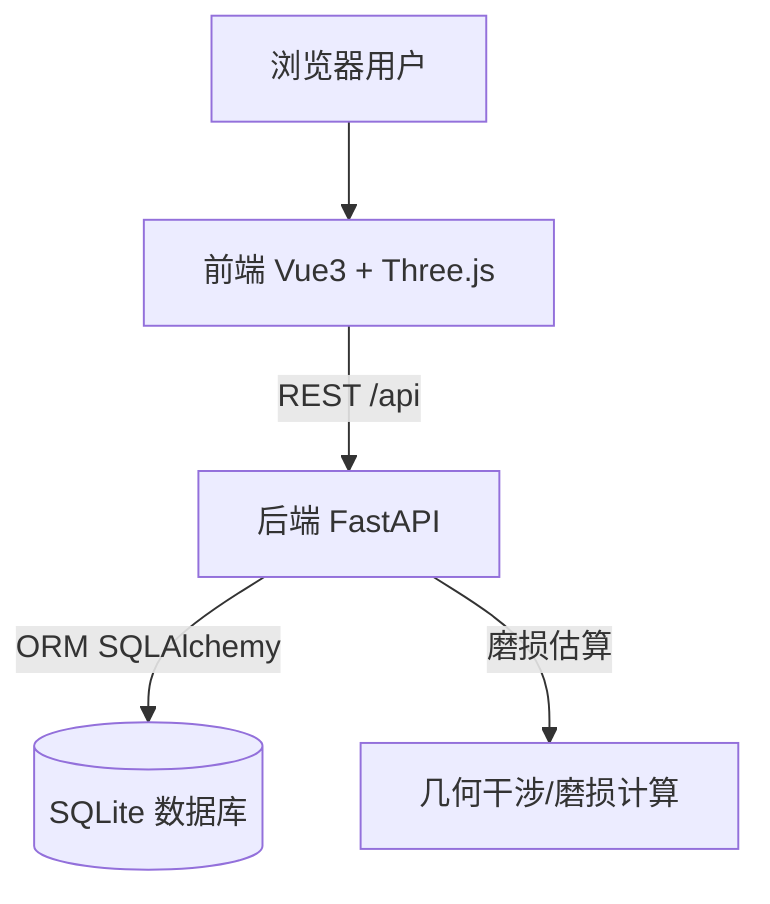
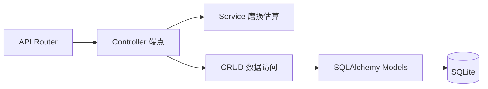
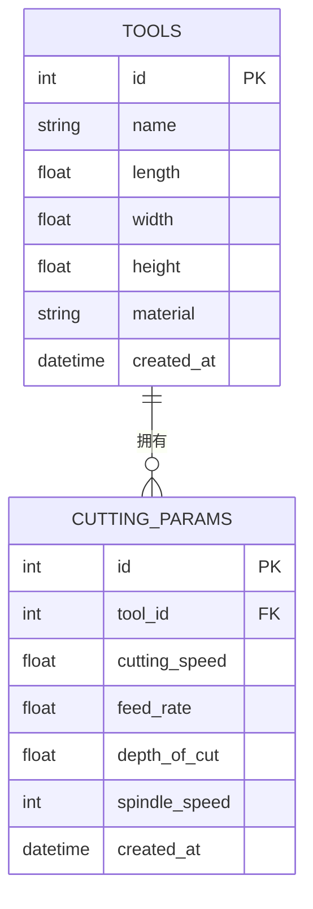

## 1. 架构设计

系统采用前后端分离架构。前端为 Vue3 单页应用负责三维渲染与交互，后端为 Python FastAPI 服务负责数据持久化与磨损估算。数据存储于 SQLite 文件库。前后端通过 REST API 通信，开发期通过 Vite 代理解决跨域。



## 2. 技术说明

- **前端**：Vue@3 + TypeScript + Vite + Tailwind CSS + Three.js + @vueuse/core
- **初始化工具**：vite-init（vue-ts 模板）
- **后端**：Python FastAPI + Uvicorn + SQLAlchemy 2.x + Pydantic v2
- **数据库**：SQLite（文件库 `backend/data/sim.db`），便于零配置启动
- **包管理**：前端使用 pnpm；后端使用 pip + requirements.txt

## 3. 路由定义

| 路由 | 用途 |
|-------|---------|
| `/` | 模拟器主页（三维视口 + 控制面板 + HUD） |
| `/database` | 工艺数据库页（刀具与切削参数列表） |

## 4. API 定义

### 4.1 刀具接口 `/api/tools`

- `GET /api/tools`：查询全部刀具
- `POST /api/tools`：新增刀具
- `GET /api/tools/{id}`：查询单把刀具
- `DELETE /api/tools/{id}`：删除刀具

```ts
interface Tool {
  id: number
  name: string
  length: number   // mm
  width: number    // mm
  height: number   // mm
  material: string // 刀具材料
  created_at: string
}
```

### 4.2 切削参数接口 `/api/cutting-params`

- `GET /api/cutting-params?tool_id=`：按刀具查询参数
- `POST /api/cutting-params`：新增切削参数
- `DELETE /api/cutting-params/{id}`：删除

```ts
interface CuttingParam {
  id: number
  tool_id: number
  cutting_speed: number  // m/min 切削速度
  feed_rate: number      // mm/rev 进给量
  depth_of_cut: number   // mm 切深
  spindle_speed: number  // rpm 主轴转速
  created_at: string
}
```

### 4.3 仿真估算接口 `/api/simulation/wear`

- `POST /api/simulation/wear`：基于参数与切削时长估算磨损

```ts
interface WearRequest {
  cutting_speed: number  // m/min
  feed_rate: number      // mm/rev
  depth_of_cut: number   // mm
  cutting_time: number   // s 已切削时长
}

interface WearResponse {
  wear_value: number  // mm 后刀面磨损量 VB
  wear_percent: number // 0-100
  status: 'normal' | 'warning' | 'critical'
}
```

## 5. 服务端架构图



## 6. 数据模型

### 6.1 数据模型定义



### 6.2 数据定义语言 (DDL)

```sql
CREATE TABLE tools (
  id INTEGER PRIMARY KEY AUTOINCREMENT,
  name TEXT NOT NULL,
  length REAL NOT NULL,
  width REAL NOT NULL,
  height REAL NOT NULL,
  material TEXT NOT NULL DEFAULT '硬质合金',
  created_at TIMESTAMP DEFAULT CURRENT_TIMESTAMP
);

CREATE TABLE cutting_params (
  id INTEGER PRIMARY KEY AUTOINCREMENT,
  tool_id INTEGER NOT NULL,
  cutting_speed REAL NOT NULL,
  feed_rate REAL NOT NULL,
  depth_of_cut REAL NOT NULL,
  spindle_speed INTEGER NOT NULL,
  created_at TIMESTAMP DEFAULT CURRENT_TIMESTAMP,
  FOREIGN KEY (tool_id) REFERENCES tools(id) ON DELETE CASCADE
);

CREATE INDEX idx_cutting_params_tool_id ON cutting_params(tool_id);
```

## 7. 项目目录结构

```
da4/
├── frontend/                  # Vue3 前端
│   ├── src/
│   │   ├── components/         # 3D 与 UI 组件
│   │   ├── composables/        # 可复用逻辑
│   │   ├── views/              # 页面
│   │   ├── stores/             # 状态管理
│   │   ├── api/                # 后端接口封装
│   │   ├── utils/              # 工具函数
│   │   └── router/             # 路由
│   ├── package.json
│   └── vite.config.ts
├── backend/                   # Python FastAPI 后端
│   ├── app/
│   │   ├── main.py            # 应用入口
│   │   ├── database.py        # 数据库连接
│   │   ├── models.py          # ORM 模型
│   │   ├── schemas.py         # Pydantic 模型
│   │   ├── crud.py            # 数据访问
│   │   ├── simulation.py      # 磨损估算
│   │   └── routers/           # 路由模块
│   ├── data/                  # SQLite 文件
│   └── requirements.txt
└── .trae/documents/           # 文档
```
